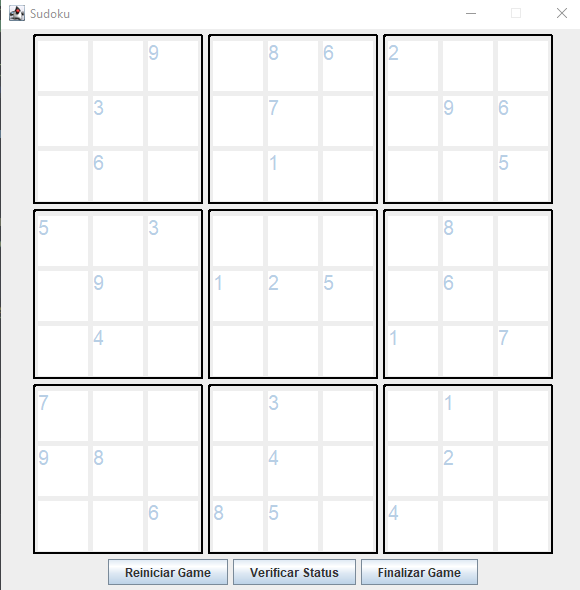
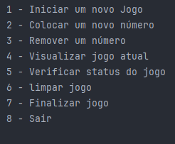
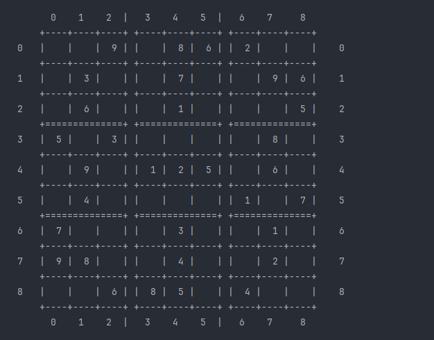

# Sudoku - Java

Este é um projeto de um jogo de **Sudoku** desenvolvido em **Java**, com duas versões disponíveis:

- **Interface Gráfica (GUI)**: Utilizando `Swing` para uma experiência visual interativa.
- **Interface via Terminal (CLI)**: Para quem prefere jogar diretamente no console.

O jogo permite ao usuário jogar, reiniciar, conferir o status do jogo e finalizar a partida. O sistema também verifica automaticamente se o tabuleiro está correto de acordo com as regras do Sudoku.

---

## 🎮 Funcionalidades

- ✅ **Verificação de Tabuleiro:** O sistema analisa se a solução atual do jogador está correta, seguindo as regras do Sudoku (valores únicos em linhas, colunas e subgrades 3x3).
- 🔄 **Reiniciar Jogo:** Permite começar uma nova partida com um novo tabuleiro.
- 🔍 **Conferir Status do Jogo:** Mostra se o tabuleiro atual está completo e se todos os valores estão corretos.
- 🛑 **Finalizar Jogo:** Encerra a partida e exibe o resultado final (vitória ou incompleto/incorreto).

---

## 💻 Tecnologias Utilizadas

- **Java 21**
- **Swing** (para a interface gráfica)
- **Lógica de matriz** para manipulação do tabuleiro
- **Entrada via Scanner** (para versão em terminal)

---

## 📷 Capturas de Tela

### 🎨 Versão Gráfica (GUI)

> Interface amigável com botões para ações e preenchimento do tabuleiro.

### 🖥️ Versão em Terminal (CLI)

> Simples e direta, ideal para rodar em qualquer sistema.

### 👨‍💻 Entrada Utilizada para testes do jogo
> 0,0;4,false 1,0;7,false 2,0;9,true 3,0;5,false 4,0;8,true 5,0;6,true 6,0;2,true 7,0;3,false 8,0;1,false 0,1;1,false 1,1;3,true 2,1;5,false 3,1;4,false 4,1;7,true 5,1;2,false 6,1;8,false 7,1;9,true 8,1;6,true 0,2;2,false 1,2;6,true 2,2;8,false 3,2;9,false 4,2;1,true 5,2;3,false 6,2;7,false 7,2;4,false 8,2;5,true 0,3;5,true 1,3;1,false 2,3;3,true 3,3;7,false 4,3;6,false 5,3;4,false 6,3;9,false 7,3;8,true 8,3;2,false 0,4;8,false 1,4;9,true 2,4;7,false 3,4;1,true 4,4;2,true 5,4;5,true 6,4;3,false 7,4;6,true 8,4;4,false 0,5;6,false 1,5;4,true 2,5;2,false 3,5;3,false 4,5;9,false 5,5;8,false 6,5;1,true 7,5;5,false 8,5;7,true 0,6;7,true 1,6;5,false 2,6;4,false 3,6;2,false 4,6;3,true 5,6;9,false 6,6;6,false 7,6;1,true 8,6;8,false 0,7;9,true 1,7;8,true 2,7;1,false 3,7;6,false 4,7;4,true 5,7;7,false 6,7;5,false 7,7;2,true 8,7;3,false 0,8;3,false 1,8;2,false 2,8;6,true 3,8;8,true 4,8;5,true 5,8;1,false 6,8;4,true 7,8;7,false 8,8;9,false

